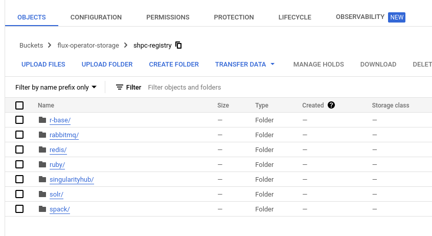

# Google Cloud Storage

This example will walk you through creating a module cache (the module files and containers)
in Google Cloud Storage. We will create a virtual machine to build our modules, and save
to cloud storage. You should have a Google Cloud Project active before you begin.
I usually do:

```bash
$ gcloud auth login
$ gcloud config set project dinodev
```

## Prepare Bucket

Make sure you've [prepared a Google Storage](https://cloud.google.com/appengine/docs/legacy/standard/python/googlecloudstorageclient/setting-up-cloud-storage) bucket.

## Virtual Machine

Prepare a virtual machine with a good amount of RAM and give access to all cloud APIS.
If you intend to scale this and have large containers to pull, it's recommended to create the VM with a large disk
that you can then set to be the `--root`, and also export the `SINGULARITY_CACHE` to be located there.

Make sure Singularity and shpc are installed, and libraries needed to interact

```bash
export DEBIAN_FRONTEND=noninteractive
sudo apt-get update && sudo apt-get update install -y \
    python3-pip \
    wget \
    build-essential \
    libseccomp-dev \
    libglib2.0-dev \
    pkg-config \
    squashfs-tools \
    cryptsetup \
    runc

# install Go
export VERSION=1.20.2 OS=linux ARCH=amd64 && \
  wget https://dl.google.com/go/go$VERSION.$OS-$ARCH.tar.gz && \
  sudo tar -C /usr/local -xzvf go$VERSION.$OS-$ARCH.tar.gz && \
  rm go$VERSION.$OS-$ARCH.tar.gz

echo 'export PATH=/usr/local/go/bin:$PATH' >> ~/.bashrc && \
  source ~/.bashrc

# Install Singularity
export VERSION=3.11.0 && \
  wget https://github.com/sylabs/singularity/releases/download/v${VERSION}/singularity-ce-${VERSION}.tar.gz && \
  tar -xzf singularity-ce-${VERSION}.tar.gz && \
  cd singularity-ce-${VERSION}

./mconfig && \
    make -C builddir && \
    sudo make -C builddir install

# Install Python Modules
pip install singularity-hpc
pip install google-cloud-storage
```

Ensure your local home is on the path (for shpc)

```bash
$ export PATH=~/.local/bin:$PATH
```

Then prepare a text file with the containers you want to build and install.
To generate the entire registry you can do:

```bash
$ shpc show > containers.txt
```

Or create it manually, here is an example (much smaller) set:

```text
r-base
rabbitmq
redis
ruby
singularityhub/singularity-deploy
solr
spack/ubuntu-bionic
tensorflow/tensorflow
tomcat
uvarc/qiime2
vanessa/salad
vault
```

Next, run the script here, targeting your containers.txt. You can use [gcloud compute copy-file](https://cloud.google.com/sdk/gcloud/reference/compute/copy-files)
to get the file to your VM. E.g., this would copy to your home:

```bash
$ gcloud compute copy-files ./google-cloud-storage.py shpc-registry-builder:~/ --zone=us-central1-a
```

The bucket should include the bucket name and prefix that you want to use. **Important** if you intend to scale this
and have large containers to pull, it's recommended to create the VM with a large disk that you can then set to be the `--root`,
and also export the `SINGULARITY_CACHE` to be located there. By default, the install `--root` will be to `~/shpc-cache`.

```bash
$ python3 google-cloud-storage.py containers.txt --bucket gs://flux-operator-storage/shpc-registry
```

Note that you have good control over a bunch of parameters, including whether to keep containers on the file system,
and how many container pulls to do at once (be careful about filling up the filesystem). It's currently set to a small
value (2) to be conservative as I was testing on a small instance.

```bash
$ python3 google-cloud-storage.py --help
```
```console
...
SHPC Google Cloud Storage Adder

positional arguments:
  containers            Path to containers.txt file

optional arguments:
  -h, --help            show this help message and exit
  --force               Force reinstall of module
  --bucket BUCKET       Bucket name and prefix
  --root ROOT           Install root for modules and containers
  --keep                Don't clean up as we go (only recommended if you have a large filesystem)
  --workers WORKERS     Number of workers to use
  --group-size GROUP_SIZE
                        Number containers to pull at once (before clearing cache)
```

When you are done, your storage will be populated with modules, container images,


